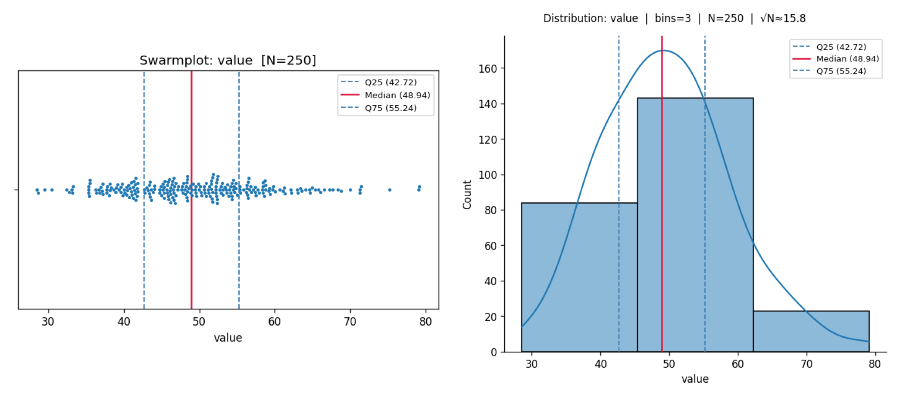
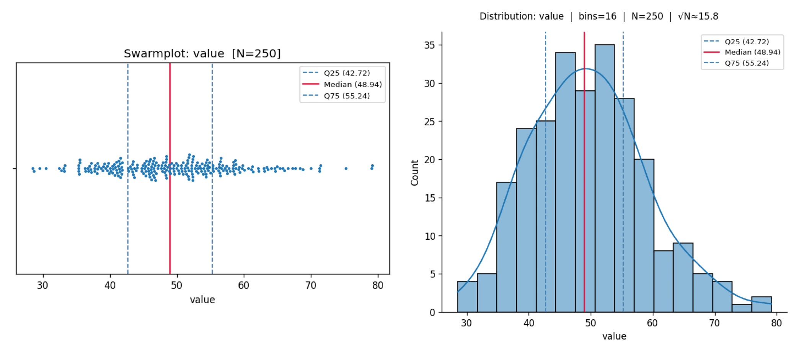
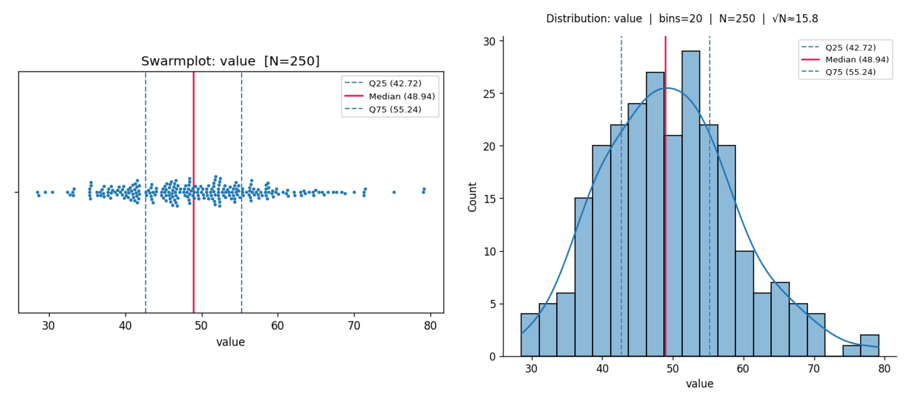

# explore-dist

A Claude Code slash command for interactively exploring the distribution of a dataset column. Generates a swarmplot and histogram side by side, lets you tune the bin count in a live loop, then saves the final figure to disk.

## What it does

1. Loads a CSV/TSV/XLSX dataset and selects a numeric column
2. Renders a **horizontal swarmplot** and a **displot** (with KDE) side by side
3. Overlays the **median** (red) and **Q25/Q75** (blue dashed) on both plots
4. Asks whether to keep the current bins (default = √N) or enter a new count — repeats until you're satisfied
5. Asks where to save the final figure, then writes it to disk at 150 dpi

## Installation

Copy `explore-dist.md` to your Claude Code user commands folder:

```
# macOS / Linux
cp explore-dist.md ~/.claude/commands/explore-dist.md

# Windows
copy explore-dist.md %USERPROFILE%\.claude\commands\explore-dist.md
```

The Python helper script (`explore_dist.py`) is written automatically to `C:\Windows\Temp\` (Windows) or `/tmp/` on first run — no manual install needed.

### Dependencies

```bash
pip install pandas seaborn matplotlib numpy
# For Excel support:
pip install openpyxl
```

## Usage

```
/explore-dist <dataset_path> [column_name]
```

| Argument | Description |
|---|---|
| `dataset_path` | Path to a `.csv`, `.tsv`, `.xlsx`, or `.xls` file |
| `column_name` | Column to visualize (optional — defaults to the first numeric column) |

### Example session

```
/explore-dist data/measurements.csv weight

Plots are open. Column: weight | N = 250 | Current bins: 16 (√N ≈ 15.81)
Keep this binning, or enter a different bin count?

> 20

Plots are open. Column: weight | N = 250 | Current bins: 20 (√N ≈ 15.81)
Keep this binning, or enter a different bin count?

> keep

Where would you like to save the figure? (Press Enter to use the dataset's folder)

> C:\Users\nina\figures

Figure saved to: C:\Users\nina\figures
```

## Example output

Generated from `example/gaussian_250.csv` — 250 samples from 𝒩(50, 10):

**3 bins**


**16 bins** (≈ √N)


**20 bins**


## Supported file formats

| Extension | Format |
|---|---|
| `.csv` | Comma-separated |
| `.tsv` / `.txt` | Tab-separated |
| `.xlsx` / `.xls` | Excel |

## Notes

- The swarmplot subsamples to 400 points when N > 400 to keep rendering fast; the histogram always uses the full dataset
- Bins default to round(√N) on the first run; you can override at any iteration
- The output filename is `distribution_<column>_bins<N>.png`
